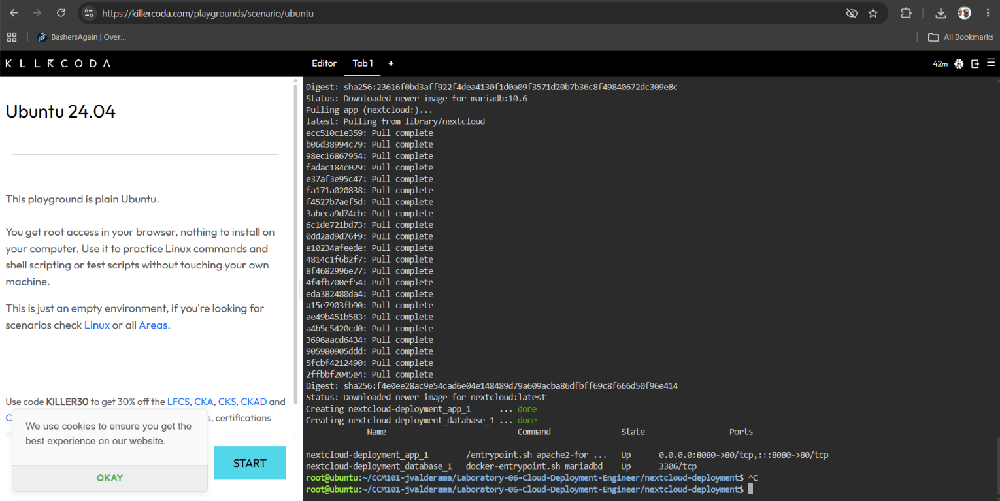

# Laboratory 6: The Cloud Deployment Engineer

## Mission Overview

In this mission, I acted as a member of the Cloud Deployment Team at CloudNova Technologies. Instead of deploying single containers manually, I used Docker Compose and Infrastructure as Code (IaC) to deploy a two-tier private cloud storage application made of a Nextcloud web container and a MariaDB database container. The entire stack was deployed and torn down using a single command each.

## Objectives

- Explain the concept of a multi-tier application architecture.
- Understand the purpose and structure of a docker-compose.yml file.
- Use a Linux command-line text editor (nano) to create configuration files.
- Deploy a multi-container application (Nextcloud + Database) using Docker Compose.
- Document deployment procedures and Infrastructure as Code (IaC) principles using Markdown.
- Continue expanding my professional GitHub Cloud Computing Portfolio.

## Commands Executed

```bash
mkdir nextcloud-deployment        # create project directory
cd nextcloud-deployment           # move into the directory
nano docker-compose.yml           # create the Compose file
cat docker-compose.yml            # verify the file contents
docker-compose up -d              # deploy the stack in the background
docker-compose ps                 # verify running containers
docker-compose down               # stop and remove the stack
```

## Skills Learned

- Explaining the roles of the web/application tier and the database tier
- Writing a properly indented YAML configuration file
- Using the nano text editor and the terminal to create files
- Deploying and tearing down a multi-container application with Docker Compose
- Using environment variables to configure containers
- Accessing a containerized application through a mapped port
- Documenting infrastructure using Markdown and GitHub

## Screenshots

### Deployment


### Nextcloud Web Interface


### Teardown

