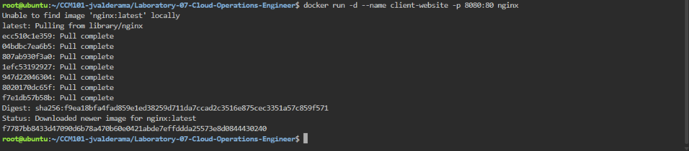
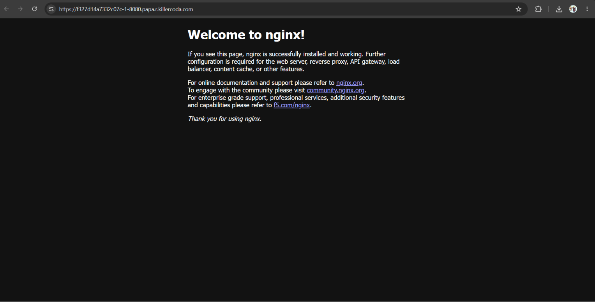
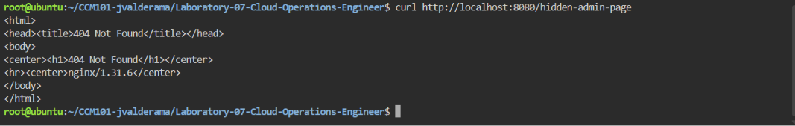
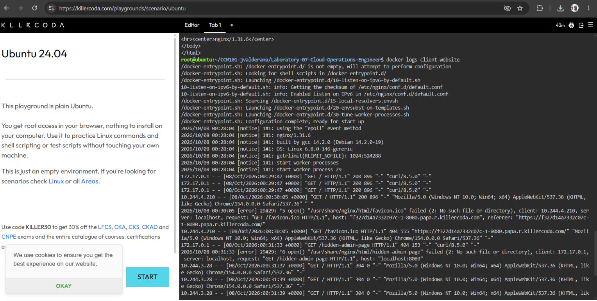
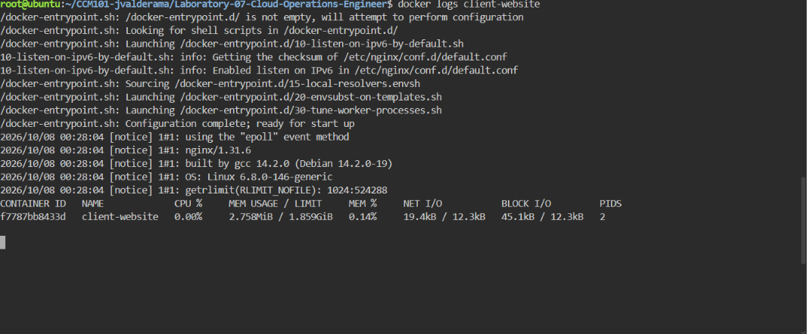

# Container Observability

## Application Log: 404 Error

```
172.17.0.1 - - [08/Oct/2026:00:31:33 +0000] "GET /hidden-admin-page HTTP/1.1" 404 153 "-" "curl/8.5.0" "-"
```

Application logs are vital for troubleshooting because they record exactly what each user requested and how the server responded, including the status codes. They let an engineer find when and why a problem happened, such as this 404 for a page that does not exist, instead of guessing.

## Log Analysis

From `docker logs client-website`, the simulated traffic produced the following:

| Request | Status Code | Count |
|---|---|---|
| `GET /` (curl) | 200 OK | 3 |
| `GET /hidden-admin-page` (curl) | 404 Not Found | 1 |

The logs also show extra browser requests (a `favicon.ico` 404 and several `304 Not Modified` responses) that came from opening the site through the KillerCoda port access.

## Real-Time Container Metrics

| Metric | Value |
|---|---|
| Container | client-website |
| CPU % | 0.00% |
| Memory Usage | 2.758MiB |
| Memory Limit | 1.859GiB |
| Memory % | 0.14% |
| Network I/O | 19.4kB / 12.3kB |
| Block I/O | 45.1kB / 12.3kB |
| PIDs | 2 |

The container uses almost no CPU and only 2.758MiB of memory (0.14% of the available 1.859GiB), so it is healthy and ready for increased traffic.

## Screenshots






