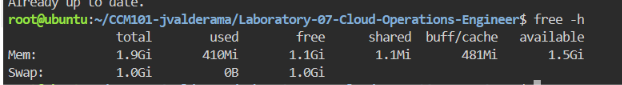
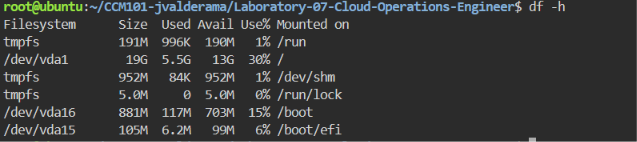

# System Baseline Report

## Host Resources

| Resource | Value |
|---|---|
| Total RAM | 1903.2 MiB (about 1.9 GiB) |
| Total Storage (/) | <Size of / from df -h, e.g. 19G> |

## Additional Baseline Observations (from `top`)

| Metric | Value |
|---|---|
| Memory used | 422.2 MiB |
| Memory free | 1124.4 MiB |
| Available memory | 1481.1 MiB |
| Swap | 1024.0 MiB total, 0.0 used |
| CPU idle | 99.0% |
| Load average | 0.00, 0.00, 0.00 |
| Tasks | 131 total, 1 running, 130 sleeping |

The server is mostly idle, which gives a healthy baseline before any application traffic is introduced.

## Why Check Disk Space?

Checking disk space before a traffic surge is critical because a full disk can stop the server from writing logs and data, which can crash the application when many users visit at once.

## Screenshots

